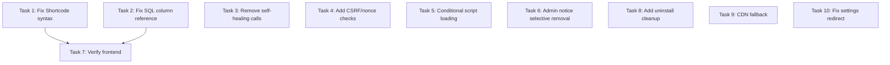

# Tasks - Perbaikan WP Desa

## Task Priority & Dependency

## Tasks

- [x] **Task 1**: Fix syntax error di Shortcode.php (line 1511) — `<span:>` → ``
  - File: [Shortcode.php](file:///g:/DEV/app/public/wp-content/plugins/wp-desa/src/Frontend/Shortcode.php)
  - Sintaks `<span:>` telah diperbaiki

- [x] **Task 2**: Hapus referensi kolom `agama` yang tidak ada di PrintHandler.php SQL JOIN
  - File: [PrintHandler.php](file:///g:/DEV/app/public/wp-content/plugins/wp-desa/src/Admin/PrintHandler.php)
  - `r.agama` dihapus dari SELECT query

- [x] **Task 3**: Hapus panggilan `Activator::activate()` dari semua API Controller
  - Files: ResidentController.php, LetterController.php, ComplaintController.php, FinanceController.php
  - Panggilan Activator::activate() di method create sudah dihapus

- [x] **Task 4**: Tambahkan verifikasi nonce/CSRF pada export CSV dan print letter
  - File: ResidentController.php (export_items), PrintHandler.php (handle_print), letters.php template
  - Nonce verification via `_wpnonce` parameter + `wp_rest` / `wp_desa_print_letter` action

- [x] **Task 5**: Conditional loading Chart.js, Glightbox, Lucide hanya jika shortcode aktif
  - File: Shortcode.php
  - `has_shortcode()` check untuk setiap library, hanya dimuat jika shortcode terkait ada

- [x] **Task 6**: Ubah `remove_all_actions` jadi selective notice removal
  - File: Menu.php
  - CSS `.notice { display: none }` via echo, bukan nuke semua action

- [x] **Task 7**: Ganti `error_log()` dengan conditional `WP_DEBUG` check
  - File: ResidentController.php
  - Semua `error_log()` dibalut `if (defined('WP_DEBUG') && WP_DEBUG)`

- [x] **Task 8**: Tambahkan uninstall.php untuk cleanup database tables & options
  - File baru: uninstall.php
  - Membersihkan 7 tabel, options, post meta, posts, dan taxonomy terms

- [x] **Task 9**: Tambahkan local fallback untuk CDN dependencies
  - File: Menu.php, Shortcode.php
  - Inline script fallback: load dari `assets/js/` jika CDN gagal

- [x] **Task 10**: Perbaiki Settings redirect — gunakan `wp_redirect()` bukan JS
  - File: Menu.php
  - Form processing via `admin_init` hook, `wp_redirect()` + `exit`

## Task Dependencies

- Task 1 → independent (high priority)
- Task 2 → independent (high priority)
- Task 3 → independent (medium priority)
- Task 4 → independent (medium priority)
- Task 5 → depends on Task 1 (low-medium priority)
- Task 6 → independent (low priority)
- Task 7 → independent (low priority)
- Task 8 → independent (low priority)
- Task 9 → independent (low priority)
- Task 10 → independent (low priority)
